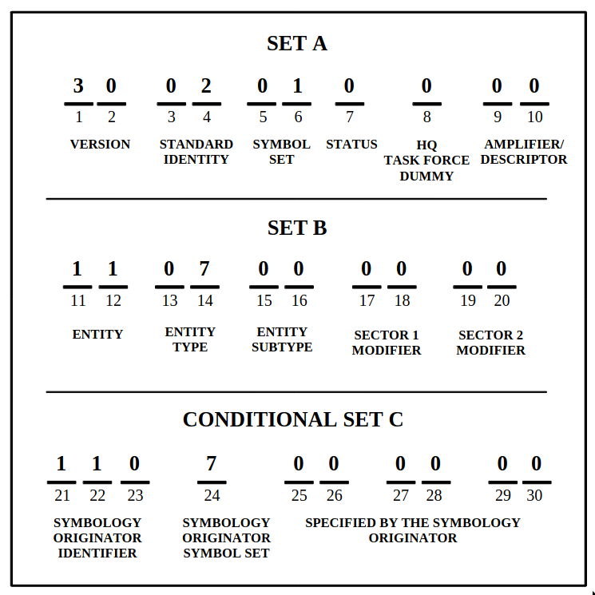

# Fuzzy SIDC search

**Use JS lib in Python to get SVG by SIDC:**
- https://github.com/kjellmf/sidc-picker
    - https://sidc.milsymb.net/
    - https://github.com/spatialillusions/stanag-app6
    - https://github.com/spatialillusions/mil-std-2525
- https://spatialillusions.com/unitgenerator/
    - https://github.com/spatialillusions/milsymbol/releases/tag/v2.2.0
- https://stackoverflow.com/questions/10136319/executing-javascript-from-python
    - https://bpcreech.com/PyMiniRacer/
- https://stackoverflow.com/questions/1014506/imagemagickerror-unable-to-read-font-null-null
    - https://stackoverflow.com/a/21911955/7599215
- https://stackoverflow.com/questions/9853325/how-to-convert-a-svg-to-a-png-with-imagemagick
    - https://cairosvg.org/
- https://stackoverflow.com/questions/5466451/how-do-i-escape-curly-brace-characters-characters-in-a-string-while-using

**Data structure for NATO signs:**
- https://www.jcs.mil/portals/36/documents/doctrine/other_pubs/ms_2525d.pdf
- https://github.com/spatialillusions/stanag-app6
- https://github.com/spatialillusions/mil-std-2525

